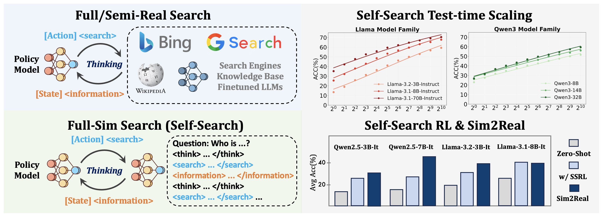
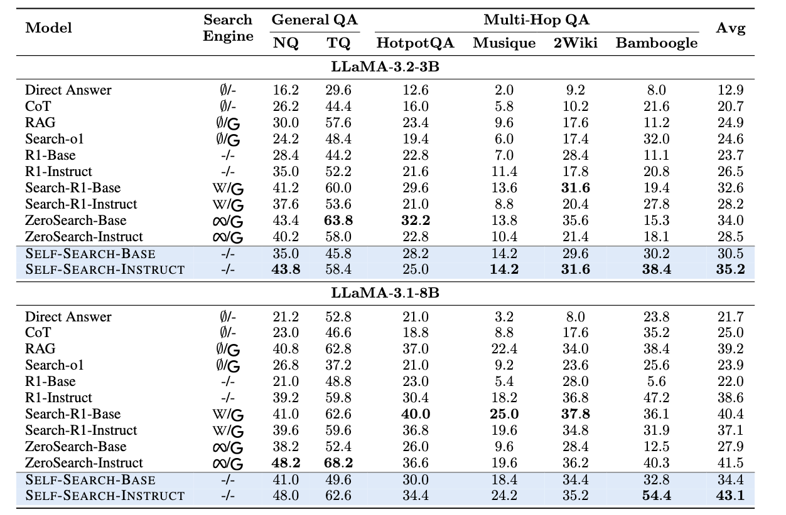
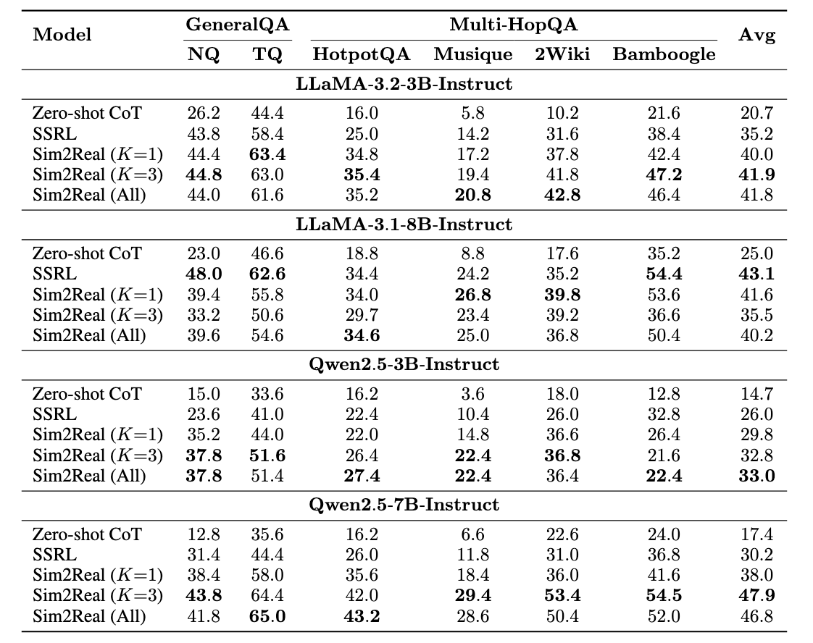

<div align="center">

# SSRL: Self-Search Reinforcement Learning

[](https://arxiv.org/abs/2508.10874)  [](https://github.com/TsinghuaC3I/SSRL)
[](https://wandb.ai/yuchenfan/Rethink%20Search%20Scaling/reports/SSRL--VmlldzoxMzg3Nzc0NA)
[](https://huggingface.co/collections/TsinghuaC3I/ssrl-6899957a64d4a31f7f43bc88)
[](https://huggingface.co/datasets/TsinghuaC3I/SSRL)
</div>

<div align="center" style="font-family: Arial, sans-serif;">
  <p>
    <a href="#news" style="text-decoration: none; font-weight: bold;">🎉 News</a> •
    <a href="#introduction" style="text-decoration: none; font-weight: bold;">📖 Introduction</a> •
    <a href="#main-results" style="text-decoration: none; font-weight: bold;">📊 Main Results</a>
  </p>
  <p>
    <a href="#getting-started" style="text-decoration: none; font-weight: bold;">✨ Getting Started</a> •
    <a href="#contact" style="text-decoration: none; font-weight: bold;">📨 Contact</a> •
    <a href="#citation" style="text-decoration: none; font-weight: bold;">🎈 Citation</a> •
    <a href="#star-history" style="text-decoration: none; font-weight: bold;">🌟 Star History</a>
  </p>
</div>

# 🎉News

- **[2025-04-23]** We present **SSRL** (Self-Search Reinforcement Learning), an investigation for Agentic Search RL without reliance on external search engine.
  
# 📖Introduction

**We investigate Reinforcement Learning (RL) on Agentic search tasks without explicit gathering information from external search engines, e.g., LLMs, web engines.**
Previous work leverage external search engines during training, which is expensive and time-consuming, yet introducing training instability. We introduce SSRL, a novel approach that enables RL on Agentic search tasks without the need for explicit search engines which achieves comparable performance to previous methods. Though trained totally offline, it can be seamlessly applied to online search engines, and further boost its performance. 

<p align="center">
   
</p>

<!-- 
<p align="center">
   
</p> -->


# 📊Main Results

We first show that the high upper bound of Self-Search by using structured prompt, with the LLM serving as the search engine and the policy simultaneously. 

<p align="center">
   
</p>
<p align="center">
   
</p>
<p align="center">
   
</p>

After that, we experiment on SSRL to teach LLMs how to leverage self-search capabilities effectively. Our results demonstrate that SSRL consistently improves performance across a variety of tasks and models.

Furthermore, although SSRL is trained offline, it can be seamlessly applied to online search engines, further boosting its performance.

<p align="center">
   
</p>

<p align="center">
   
</p>


# ✨Getting Started

You can reproduce the results of SSRL with the following commands:

```bash
git clone https://github.com/TsinghuaC3I/SSRL
cd verl

pip install -r requirements.txt

huggingface-cli download --repo-type dataset --resume-download TsinghuaC3I/SSRL --local-dir SSRL_dataset # download the dataset

bash examples/ssrl/example.sh
```

To evaluate the trained model with Sim2Real generalization, you can run:

```bash
bash examples/ssrl/sim2real.sh
```

If you want to try entropy guided Sim2Real generalization, turn on the `trainer.use_entropy` flag in the `sim2real.sh` script.

*All experiments were conducted on 8 x NVIDIA A800 80GB GPUs.*

# 📨Contact

- Kaiyan Zhang: zhang-ky22@mails.tsinghua.edu.cn

- Ning Ding: dingning@mail.tsinghua.edu.cn

# 🎈Citation
If you find SSRL helpful, please cite us.

```bibtex
@misc{fan2025ssrlselfsearchreinforcementlearning,
      title={SSRL: Self-Search Reinforcement Learning}, 
      author={Yuchen Fan and Kaiyan Zhang and Heng Zhou and Yuxin Zuo and Yanxu Chen and Yu Fu and Xinwei Long and Xuekai Zhu and Che Jiang and Yuchen Zhang and Li Kang and Gang Chen and Cheng Huang and Zhizhou He and Bingning Wang and Lei Bai and Ning Ding and Bowen Zhou},
      year={2025},
      eprint={2508.10874},
      archivePrefix={arXiv},
      primaryClass={cs.CL},
      url={https://arxiv.org/abs/2508.10874}, 
}
``` 

<!-- # 🌟Star History

[](https://www.star-history.com/#YuchenFan48/SSRL&Date) -->
